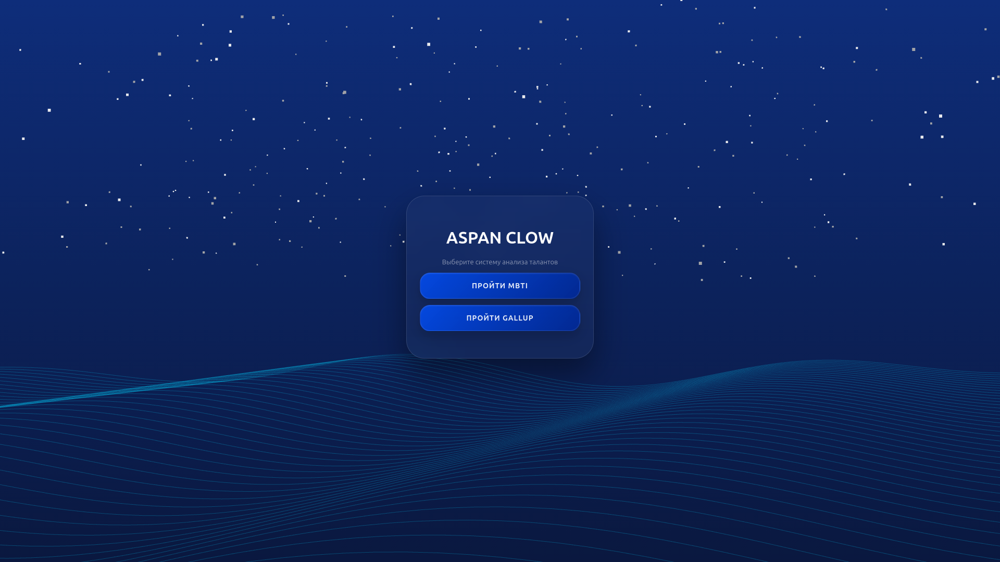
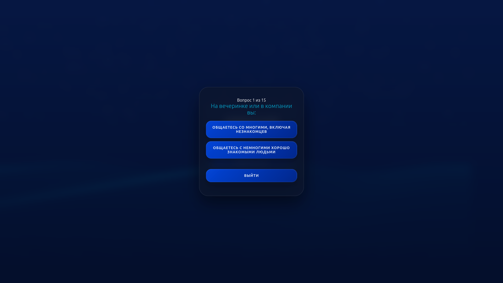
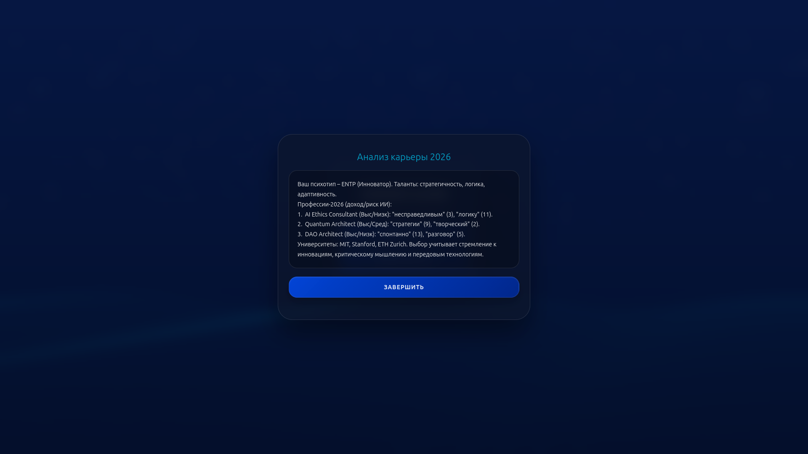

# Aspan-Clow — ИИ-Профориентолог нового поколения

Интеллектуальная система профориентации, которая анализирует личность пользователя по двум фундаментальным методологиям (**MBTI** и **Gallup**), а затем с помощью ИИ генерирует индивидуальный карьерный трек и подбирает лучшие вузы.

---

## Демонстрация работы (Как это устроено)

Вся магия происходит в три шага: прохождение тестов ➡️ сбор контекста бэкендом ➡️ анализ и генерация персонализированного отчета от Gemini с учетом актуального рынка труда.

### ⚡ Быстрый обзор процесса


<details>
  <summary>Посмотреть скриншоты интерфейса (Нажмите, чтобы раскрыть)</summary>
  
  ### 1. Тестирование (MBTI + Gallup)
  Панель прохождения тестов, где собираются уникальные паттерны мышления и сильные стороны пользователя.
  
  
  ### 2. Результат генерации ИИ
  Сжатый, точечный вердикт от ИИ-профориентолога с анализом рынка, потенциалом дохода и подбором вузов.
  
</details>

---

## Главные фичи проекта

* 🧠 **Глубокий анализ личности:** Система объединяет результаты теста на психотип (**MBTI**) и сильные стороны по методологии **Gallup**, формируя полный портрет пользователя.
* 🌐 **Интеграция с Gemini 2.5 Flash + Web Search:** Благодаря использованию модели Gemini с функцией веб-поиска, ИИ анализирует реальную ситуацию на рынке труда прямо в текущую секунду. Рекомендации по профессиям и вузам всегда остаются актуальными и свежими.
* 🎯 **Лаконичные и точные выводы:** Промпт оптимизирован так, чтобы пользователь получал выжимку «без воды» (до 70 слов) — только факты, обоснования со ссылками на его ответы, оценка дохода и риски автоматизации (замены искусственным интеллектом).

## Логика работы ИИ (Промпт)

Сервер агрегирует все ответы пользователя в единый контекст и отправляет структурированный запрос к модели:

```javascript
prompt: `Ты — элитный профориентолог в 2026 году. 
Проанализируй результаты тестов пользователя:
${contextForAI}

ТВОЯ ЗАДАЧА:
1. Определи психотип (MBTI) и главные таланты (Gallup).
2. Учитывая реалии рынка труда на апрель 2026 года, предложи 3 прибыльные профессии.
3. ОБОСНУЙ выбор, цитируя ответы пользователя из тестов.
4. Оцени потенциал дохода и риск замены ИИ.
5. Учитывая реалии рынка труда на апрель 2026 года, предложи 3 университета учитывая так же тип личности и т.д
6. Пиши максимально сжато, по фактам, с размером как заключение всю информацию сожми, до 70 слов.
Отвечай на русском языке, не добавляй звездочек и т.д`
